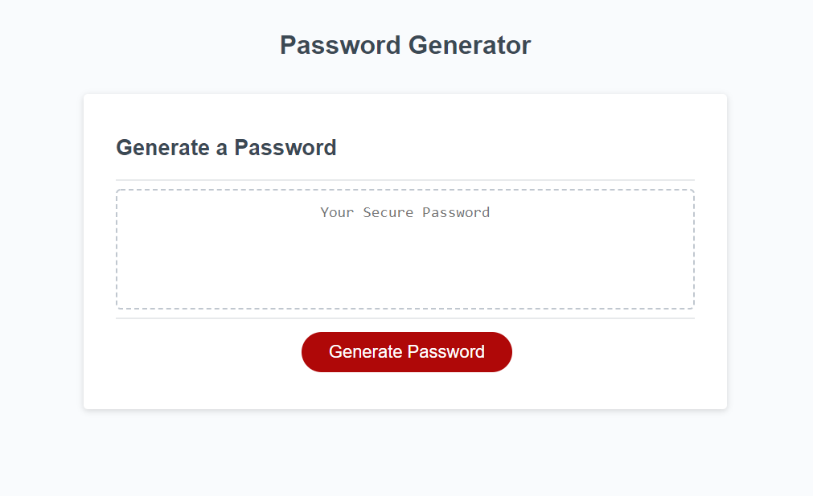

# 03_Password_Generator

## Project Goal
    Make a appliction employees can use to generate a randomized password based on the crites they selected. The appliction will run in the browser and features HTML and CSS that is powered by JavaScript. The application needs to have a clean user interface. 
    


## User Story

```
AS AN employee with access to sensitive data
I WANT to randomly generate a password that meets certain criteria
SO THAT I can create a strong password that provides greater security
```


## Live Appliction Image
    
